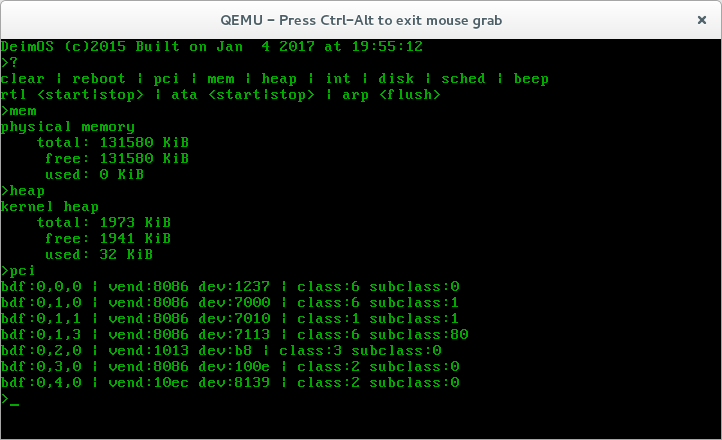
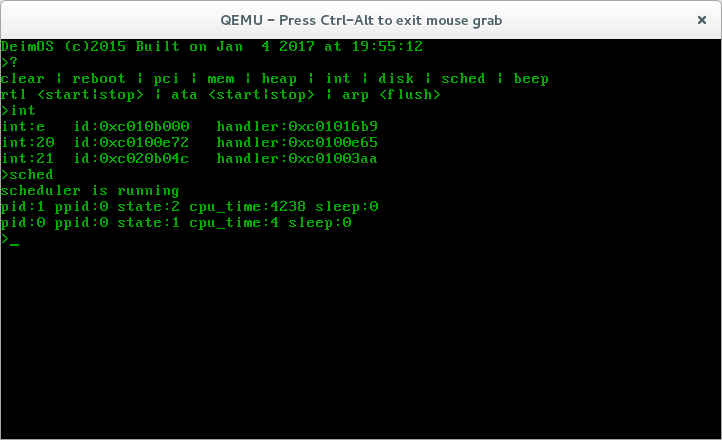

# deimos
An operating system kernel written from scratch for the x86 architecture.

## Motivation
Most sane individuals that desire to learn about the world of operating systems choose to poke around the Linux kernel. I, however, came across the OSDev.org wiki one day and their plethora of knowledge and examples. I knew instantly that it would be much more fun and informative to write my own rudimentary OS from nothing.

## Platforms, Kernels, and Drivers
It took quite some time to read up on the basics of operating systems and the specifics of the x86 architecture, but slowly over the course of many weeks it began to take shape. Unfortunately, there really isn't much to 'see' of the system, as a kernel isn't a user program, so there are only a couple of screenshots here.

The first thing was compiling a cross-compiler so that it could on the correct architecture, for which I chose i686. From there, I used OSDev.org's Bare Bones example to get started and eventually completely replaced that as I grew comfortable with how things needed to work. I ended up using GRUB Multiboot for bootstrapping into my kernel since it offered an easy way of getting my kernel into memory on a variety of systems and eliminated the need for playing with messy BIOS calls. Finally, I was able to print to the terminal: Hello World!

From there, many things happened and grew in parallel, since much of the low level functions are necessarily interconnected. Filling out the GDT and IDT, programming the PIC and handling interrupts, and writing a rudimentary PS/2 keyboard driver were early tasks. Since in the bare metal world of OSes there is no C standard library, I had to implement simple versions of functions like memcpy, strcmp, getchar, printf, etc.

Next came memory management, a key function of a kernel. Originally everything ran in real mode, but once I added GRUB, it dropped my kernel into protected mode. I wrote a simple bitmap-based physical memory manager that reads the ranges of available memory that gets passed via multiboot. On top of that came the virtual memory manager that maps the kernel to the higher half in conjunction with some early boot code and sets up the kernel's page tables.

Now came a more academic challenge: writing kernel heap for dynamic memory allocation. To start, I chose to use a simple linear free-list and wrote free() such that it automatically defragments the heap. In the future, it may be rewritten to be a slab allocator or buddy system.
Possibly one of the hardest things I've had to understand and implement was multitasking. While writing a scheduler isn't too hard, and there are many, many different scheduling algorithms to have to fun with, the real trouble/fun was to actually get the context switching to work correctly with all the registers and stacks switching cleanly between interrupts. After a quick return to programming the PIT, I was able to add a sleep() function and I then had a multitasked kernel!

Just having a kernel running in memory can't do very much, so it was time to try to write a driver. But, before I could do that I had to be able to see what devices were on the PCI bus. So I wrote a brute force PCI bus enumerator that searched for attached devices and populated a data structure for drivers to use later. With the available knowledge on OSDev.org about the RTL8139 network card and the fact that I conveniently own an older x86 PC with that exactly network card, I set out to write a driver for it. After much frustration, it was able to receive ethernet packets! Sending packets back is still a little ways off. Once the packets are handed off to the kernel-proper, there isn't much in the way of a proper TCP/IP stack right now, but it can at least read ARP messages and build an ARP cache. 

To take a break from the frustrations of network driver programming, I chose to enjoy the frustrations of storage driver programming. I initially decided against using DMA for this and wrote an ATA driver using port IO. It can read the disks attached to the bus and parse their MBR and partition tables. I've only written skeletons for the read/write functions until I flesh out the scheduling system and implement safe locking mechanisms so that processes can access ATA devices asynchronously and safely.

For testing I started with QEMU. Once I got to writing drivers I decided to dust off an old Dell I have and get it running on real hardware. To that end, my kernel can be built to a bootable ISO image using grub-mkrescue. I also managed to get PXE networking booting working with GRUB's wonderful features, allowing me to rapidly re-compile and reboot on real hardware in the span of seconds to test changes without having to burn it to CD every time.

There's much, much more detail to this than what I've written here and I'm sure I've completed glossed over parts by accident. Sorry in advance.

## The Code
The only sane choice for this endeavor was C, with x86 assembly (AT&T syntax because of GNU Assembler) where necessary. It may be possible take advantage of C++ in the future by building out the constructors and linkages necessary for it to work on a freestanding system.

## The Future
*Everything is running in ring 0 still, so I need to write a proper user mode with system calls.
*The kernel heap should eventually be moved to something like a slab allocator or buddy blocks.
*It can't load external programs such as ELF binaries yet.
*RTL driver can't send.
*There's no IP stack beyond simple ethernet frame processing.
*ATA driver can't read/write data (pending safer multitasking)
*I should build VFS to abstract the hard disks and other device files.
*A plethora of other things...

## License
This project is released under the GPLv3.
